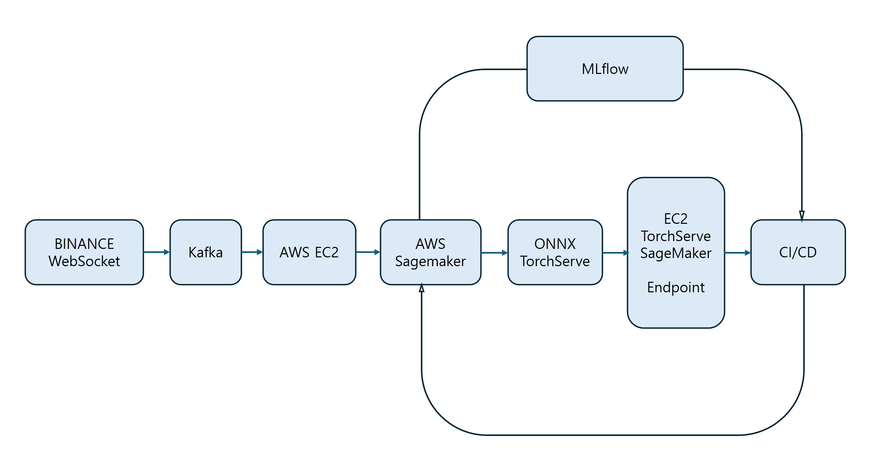

# MLOps-ybigta
MLOps project for bitcoin price prediction

### Flow

### Communication Structure
| #  | From                         | To                                 | Communication Method             | Format\Protocol                             | Description                                              |
| -- | ---------------------------- | ---------------------------------- | -------------------------------------- | ----------------------------------- | ----------------------------------------------- |
| 1  | Binance WebSocket            | Kafka Producer (EC2)               | WebSocket 수신 후 Kafka `produce`         | JSON over WebSocket → JSON to Kafka | 실시간 거래 데이터 수신 후 Kafka 토픽(`btc-trades`)으로 메시지 송신 |
| 2  | Kafka                        | EC2 Consumer (전처리기)                | Kafka `consume`                        | JSON (Kafka 메시지)                    | 실시간 메시지 소비 및 Feature 생성                         |
| 3  | EC2 전처리                      | AWS S3                             | S3 파일 업로드 (API or SDK)                 | Parquet/CSV over Boto3(SDK)         | 집계된 Feature를 S3에 저장하여 SageMaker 학습에 사용          |
| 4  | S3                           | SageMaker 학습 Job                   | SageMaker SDK 호출                       | Python SDK (HTTPS)                  | SageMaker PyTorch Estimator가 S3 경로의 데이터를 사용     |
| 5  | SageMaker 학습 중               | MLflow                             | HTTP API (Tracking)                    | REST (MLflow API)                   | 학습 중 파라미터/메트릭/모델 로그 기록                          |
| 6  | SageMaker 학습 후               | ONNX 변환기 or TorchServe 패키징         | 내부 Python 함수 호출 또는 CLI                 | `.pth` to `.onnx` or `.mar`         | 모델 포맷 변환 후 배포 준비                                |
| 7  | 모델 파일                        | 서빙 인프라 (EC2 or SageMaker Endpoint) | HTTP or CLI 등록                         | ONNX or TorchServe API              | 배포용 모델 로드 및 서비스화                                |
| 8  | 서빙 인프라                       | 클라이언트/프론트                          | REST API                               | JSON over HTTP                      | `/predict` 엔드포인트로 실시간 추론 제공                     |
| 9  | MLflow Model Registry        | CI/CD 파이프라인                        | Webhook or EventBridge → CLI or API 호출 | HTTP + Shell                        | 모델 등록 시 배포 자동화 트리거                              |
| 10 | CI/CD → 서빙 인프라               | 자동 배포 스크립트 실행                      | GitHub Actions, CodePipeline 등         | CLI/API                             | TorchServe 재배포 or SageMaker Endpoint 업데이트       |
| 11 | Endpoint → SageMaker 재학습 트리거 | EventBridge/Lambda 또는 API Trigger  | JSON + Schedule                        | 이벤트 기반으로 학습 재시작                     |                                                 |

### Work Division

| work                                     | manager   |
| ---------------------------------------- | --------- |
| s3 eventtrigger sagemaker 구조 설계        | `손재훈`   |
| sagemaker가 쓸 도커 파일 구성 (mlflow 적용)  | `엄윤희`  |
| kafka 서버 구성 (전처리 포함)                | `윤희찬` |
| torchserve 서버 / 웹서버(정적파일 호스팅용) 구성 | `양인혜` |