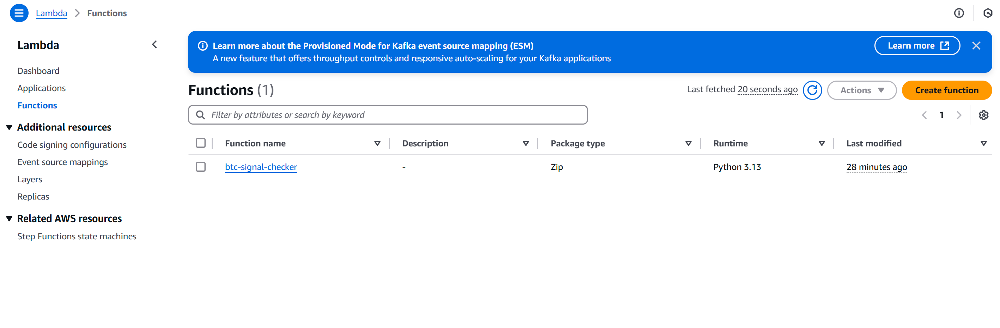
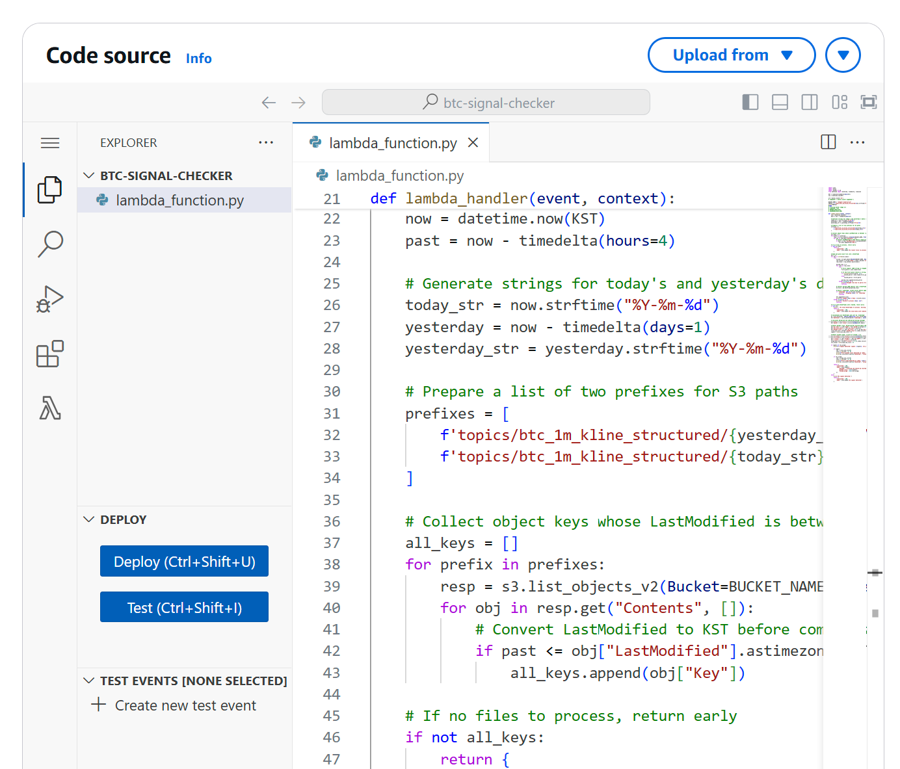
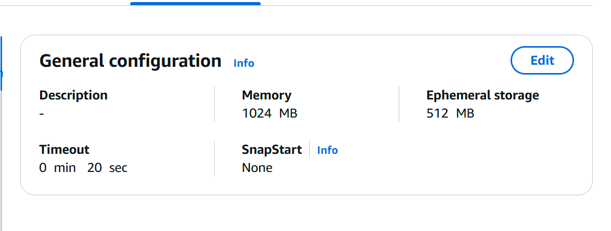
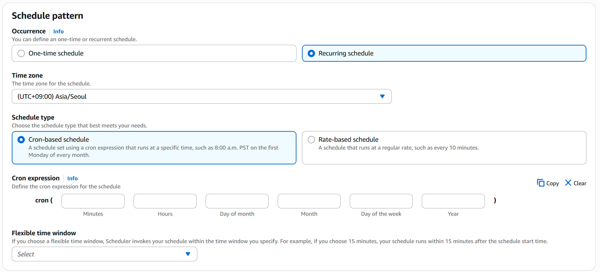

## AWS Lambda

1. Click button `Create function`


2. Lambda Code source

- Copy `signal.py` and paste to `Code source`
- Click button `Deploy` (or Ctrl+Shift+U)

3. IAM > Access management > Roles > Create role


```bash
{
  "Version": "2012-10-17",
  "Statement": [
    {
      "Effect": "Allow",
      "Action": "logs:CreateLogGroup",
      "Resource": "arn:aws:logs:<YOUR_REGION>:*"
    },
    {
      "Effect": "Allow",
      "Action": [
        "logs:CreateLogStream",
        "logs:PutLogEvents"
      ],
      "Resource": "arn:aws:logs:<YOUR_REGION>:/aws/lambda/<LAMBDA_FUNCTION_NAME>:*"
    },
    {
      "Effect": "Allow",
      "Action": [
        "s3:GetObject",
        "s3:ListBucket"
      ],
      "Resource": [
        "arn:aws:s3:::<LAMBDA_FUNCTION_NAME>",
        "arn:aws:s3:::<LAMBDA_FUNCTION_NAME>/*"
      ]
    },
    {
      "Effect": "Allow",
      "Action": [
        "s3:PutObject"
      ],
      "Resource": [
        "arn:aws:s3:::<SAGEMAKER_OUTPUT>",
        "arn:aws:s3:::<SAGEMAKER_OUTPUT>/*"
      ]
    },
    {
      "Effect": "Allow",
      "Action": [
        "sagemaker:CreateTrainingJob",
        "sagemaker:DescribeTrainingJob",
        "sagemaker:CreateModel",
        "sagemaker:CreateEndpointConfig",
        "sagemaker:CreateEndpoint",
        "sagemaker:InvokeEndpoint"
      ],
      "Resource": "*"
    }
  ]
}
```
4. In your EC2 (or in linux environment)

```bash
mkdir python
pip install pandas -t python/
zip -r pandas_layer.zip python
```
- Click button `Add a layer` in `Layers`
- AWS layers: `AWSSDKPandas-Python313` > Add

5. Edit Configuration


## AWS Eventbridge

1. Register




CRON: 0 / 0,4,8,12,16,20 / * / * / ? / *

2. Register IAM Role
```bash
{
    "Version": "2012-10-17",
    "Statement": [
        {
            "Effect": "Allow",
            "Action": [
                "lambda:InvokeFunction"
            ],
            "Resource": [
                "arn:aws:lambda:<YOUR_REGION>:function:<LAMBDA_FUNCTION>:*",
                "arn:aws:lambda:<YOUR_REGION>:function:<LAMBDA_FUNCTION>"
            ]
        }
    ]
}
```